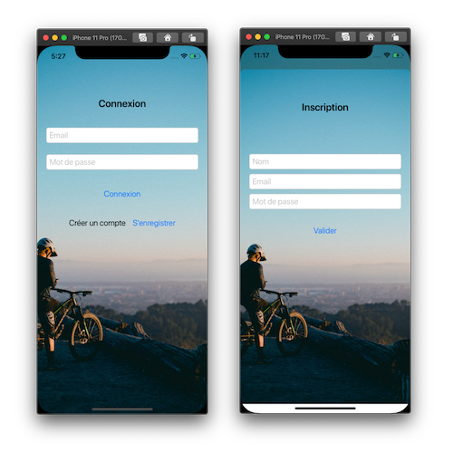
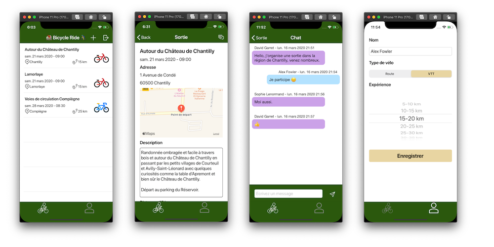

# Projet12 - Bicycle Ride
Projet libre à impact social

Bicycle Ride est une application qui permet d'organiser des randonnées en vélo.

Les fonctionnalités sont :

- Création de compte utilisateur
- Gestion du profil
- Liste des randonnées vélo
- Création d'une randonnée
  - Sélection du rendez-vous sur la carte
  - Saisie du détail de la sortie
- Consultation du détail d'une randonnée
  - Possibilité de participer
  - Echange de messages

## Technologies

- Firebase
- Mapkit
- Core Location

## Dépendances

Avec Cocoapods :

- Firebase
  - Auth
  - Firestore
- CodableFirebase

Avec Swift Package Manager :

- IQKeyboardManager

